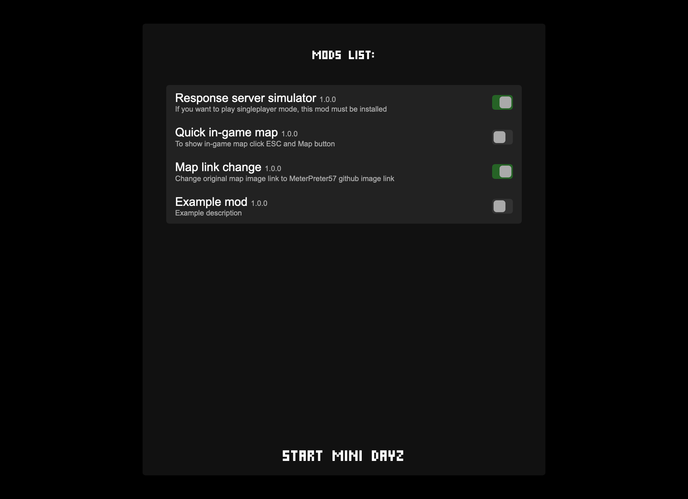

# PC Browser Mini DayZ Multiplayer
[](https://raw.githack.com/MeterPreter57/minidayz-multiplayer/main/client/index.html)

### Mods support added

## Thanks to [Meterpeter57](https://github.com/MeterPreter57) for finding all the server files and maps
## Thanks to [Alpha Systems](https://github.com/AlphaSystemsPL/) for creating the mods that fix the game


# [Play in Browser](https://raw.githack.com/IIIMGHIII/minidayz-multiplayer/main/client/index.html)

# [Server files](https://github.com/MeterPreter57/minidayz-multiplayer/releases/tag/server-files)

# [MiniDayZ SinglePlayer Version](https://github.com/MeterPreter57/MiniDayZ-PC)

## Known issues:
#### Game saving/mods/other recently added features don't work
1. Open the game  
2. Open site information (top left corner near the url)
3. Go to **Site settings**
4. Click **Delete data**
5. Reload the game and import your save


## Mods
If you want to create your own mod, create javascript file in mods/ directory, for example: mods/my-mod/my-mod.js


Now you must to add exported install function: 
#### mods/example-script/example-script.js
```js
export function install(){

}
```

Now you can add some logic, for example I tried to add listener for buttons in-game that open links, and print in console.log what they want to open:

#### mods/example-script/example-script.js
```js
export function install(){
	const original_open=window.open;
	window.open=function(url, target, windowFeatures){
		console.log(url,target,windowFeatures);
		original_open(url,target,windowFeatures);
	}
}
```

Now you need to modify mods.json, add your new mod to list:

#### mods.json
```json
{
	"mods":[
		// Other mods:
		{...},
		// Your mod:
		{
			"name":"Example mod",
			"description":"Example description",
			"script":"example-script",
			"version":"1.0.0"
		}
	]
}
```

### Testing mods
Now you can start the server, e.g. via NodeJS http-server and run the game:

